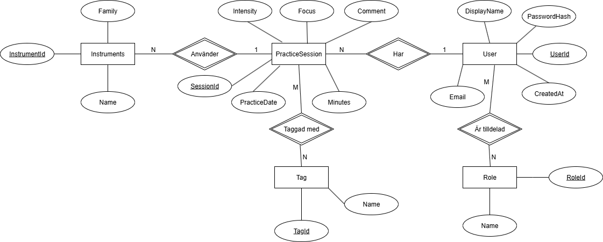
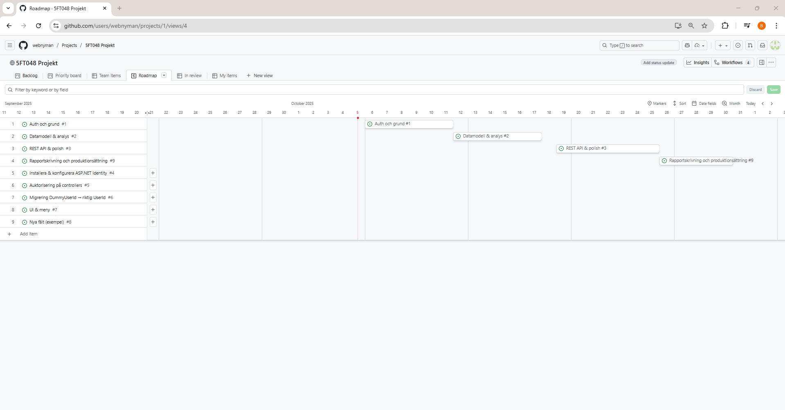
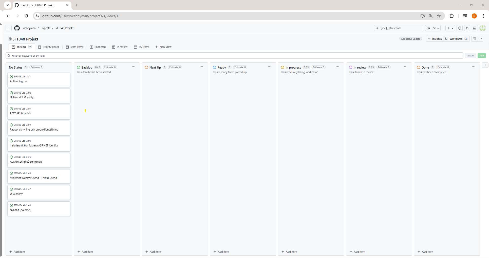

# 🧭 Projektbeskrivning – PracticeLogger Pro

## 🎯 Bakgrund
Projektet **PracticeLogger Pro** bygger vidare på tidigare laborationer där en databasdriven webbapplikation i **ASP.NET Core MVC** utvecklats för att registrera och analysera övningspass för musiker.  

Syftet med projektet är att utöka applikationen med:
- **Autentisering och auktorisering** via användarkonton och roller  
- **AI-baserad analys** av övningsdata för att ge användaren bättre övningsförslag  
- **Ett REST-API** som möjliggör framtida mobilapp i exempelvis React Native  

Systemet ska ge användaren möjlighet att:
- Logga in med egen profil och roll (t.ex. *Admin*, *User*)  
- Registrera och analysera övningspass kopplade till instrument, intensitet och fokus  
- Filtrera, sortera och visualisera sin övningsdata  
- På sikt få AI-genererade rekommendationer för mer effektiva övningsrutiner  

---

## 🧩 Systembeskrivning
Applikationen är uppbyggd enligt **MVC-mönstret** med tydlig separation mellan:

- **Presentation (Views)** – Razor-vyer för CRUD-operationer  
- **Controllerlager** – hanterar affärslogik och användarflöden  
- **Data Access Layer (DAL)** – ett egenutvecklat repository-lager som kommunicerar med SQL Server via lagrade procedurer  

Systemet följer även **Repository Pattern** och använder **Dependency Injection** för att öka testbarhet och underhållbarhet.

---

## 🗄️ Databasdesign
Systemet använder en **SQL Server-databas** med följande centrala tabeller:

| Tabell | Beskrivning |
|--------|--------------|
| **User** | Innehåller användaruppgifter och hashade lösenord |
| **Role** | Definierar olika roller i systemet |
| **UserRole** | Bryggtabell mellan User och Role (*M:N-relation*) |
| **Instrument** | Innehåller instrumentnamn och familj (t.ex. Brass, Träblås) |
| **PracticeSession** | Registrerar varje övningspass (tid, fokus, intensitet, kommentar) |
| **Tag** | Fria etiketter för kategorisering av övningspass |
| **PracticeSessionTag** | Bryggtabell mellan PracticeSession och Tag (*M:N-relation*) |

ER-schemat nedan visar tabellernas struktur, nycklar och relationer:

*

---

## 🔄 Systemflöde
Flödesschemat beskriver användarens interaktion med systemet:

1. **Login** – användaren autentiseras mot databasen  
2. **Dashboard / Index** – användaren ser sina registrerade övningspass  
3. **Add Session** – användaren registrerar nytt övningspass via formulär  
4. **Summary** – systemet hämtar summerad data via vyer och presenterar grafer  
5. **AI-analys (framtida steg)** – övningsmönster analyseras via ett externt AI-API  

Tidslinje för projektet:
*

---

## 🗂️ Projektplanering och arbetsmetodik

Projektet planeras och följs upp i **GitHub Projects** med hjälp av ett **Kanban-board**.  
Här organiseras arbetet i kolumnerna:

- **Backlog** – uppgifter som ännu inte påbörjats
- **Next Up** – uppgifter som ska påbörjas
- **In Progress** – uppgifter som aktivt bearbetas  
- **In Review / Testing** – färdiga delar som väntar på granskning eller testning  
- **Done** – slutförda uppgifter  

Varje uppgift representeras av ett **issue** som kopplas till commits och pull requests för full spårbarhet.  
På så sätt kan hela utvecklingsprocessen följas visuellt och transparent, från planering till färdig funktionalitet.

[Länk till projektet på Github](https://github.com/users/webnyman/projects/1)

📎 *Exempel på Kanban-board:*  

---

## 🧠 Fortsatt utveckling
Under projektperioden (4 veckor) kommer fokus ligga på att:
- Implementera inloggning och rollbaserad behörighet  
- Förbättra datamodellen med fler analysfält  
- Koppla på ett AI-API för att identifiera övningsmönster  
- Förbereda REST-API för framtida mobilintegration
- Produktionssätta applikationen på lämplig cloudservice eller webbhotell.

---

